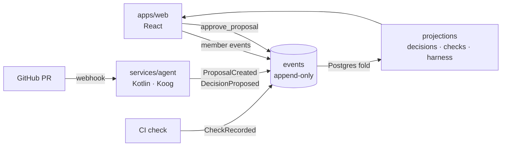
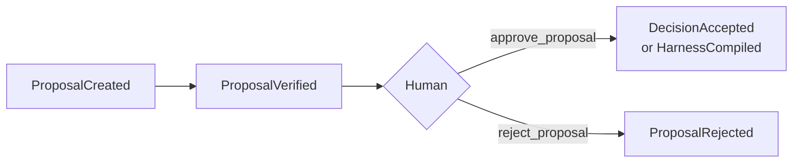

# Horizon

Event-sourced engineering memory. Architects research the system, write ADRs, and see them against the pull requests CI has recorded. An accepted decision compiles into a sensor that agents run. **AI proposes, a human approves.**

## How it works



- **Events are the only record.** Projections are rebuilt from them.
- **The agent only proposes.** It cannot approve, reject, or accept a decision.
- **Approval is one function.** `approve_proposal` writes the approval and the domain event in one transaction.
- **Verdicts are mechanical.** Schema, lint, hook, or test. Never a model.

## Lifecycle



## Layout

| Path | What |
|---|---|
| `supabase/` | Migrations, seed, config |
| `services/agent/` | Kotlin, Ktor, Koog: commands, AI, GitHub webhook |
| `apps/web/` | Vite, React, TypeScript (planned) |
| `cli/` | `horizon append` / `horizon list` |
| `docker/` | Local Supabase stack via compose |
| `docs/spec/` | Requirements, work packages, design, ADRs |

## Run locally

```sh
npm install
npm run db:start   # local Supabase + migrations
npm test           # db tests + CLI smoke test
```

## Docs

- [`idea.md`](idea.md): product narrative
- [`docs/spec/`](docs/spec/README.md): the assignment; wins over `idea.md` on conflict
