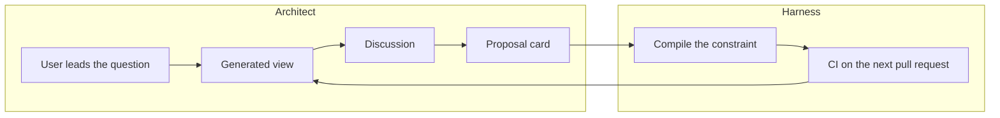

# Horizon

The architect's workspace for decisions that stay executable

  
    Press Space for the next slide
  

<!--
Open on the person, not the stack. Horizon is where an architect looks up what the system decided, sees it in the code and in open pull requests, and accepts or supersedes the ADR in that same view.
-->

---
layout: center
class: text-center
---

# Ask what the system decided

See where that decision lives in the code and in open pull requests.

Accept or supersede the ADR in the same view.

Agents then run the harness compiled from that decision. 
The next pull request shows up on it.

<!--
This is the pitch from idea.md. Do not open with the event log. The log is how the pitch stays true.
-->

---

# The work already happens

The tools split it into tabs that do not share a record.

<v-clicks>

- **Research.** What did we decide about payments, what did we reject, and which service actually does it?
- **ADR development.** The record sits beside the decision. Teams abandon it within weeks. Dedup is a person noticing two files that sound alike.
- **Overview.** No single view of accepted decisions, the paths they govern, the pull requests on those paths, and the gaps.
- **Execution.** A good ADR is still context, not a constraint. Agents violate it unless a sensor fires.

</v-clicks>

<!--
Most architectural choices never become an ADR. Current ADR tools are a per-repo TUI or a markdown folder. Reviews are not linked back onto the decision they confirm or break.
-->

---
layout: two-cols
layoutClass: gap-8
---

# Guardrails, not a prose pack

A 2026 study of 679 rule files:

<v-clicks>

- Random rules raise task success about as much as expert-written ones
- Negative constraints help
- Positive directives tend to hurt

</v-clicks>

::right::

The architect's etalon is a **decision compiled into a short guardrail or a mechanical sensor**.

Not a pack of best-practice prose. Not the ADR corpus pasted into every prompt.

Böckeler, Harness engineering, April 2026. 
Guardrails Beat Guidance, arXiv 2604.11088.

<!--
Harness engineering names the execution gap. Guides and sensors are scattered across delivery. Horizon's job is to compile the accepted decision into the sensor, then keep that artifact honest.
-->

---

# Who already stops short

| Layer | They stop at |
|---|---|
| adrkit, adr-kit, adr-warden | Typed ADRs, path scope, a terminal or a CI comment |
| Harbor | Facts proposed to an owner |
| Rulesync and similar | One markdown file, several agent formats |
| optirule | Did a rule file change behaviour? |
| A2UI | A catalog the agent fills. No architecture product |

Nobody gives the architect one workspace that researches the system, develops the ADR, shows the pull requests, and compiles the accepted decision into the harness.

<!--
Do not pitch Horizon as another ADR CLI or another format compiler. The missing product is the workspace plus the executable decision.
-->

---
layout: section
---

# Two loops, one log

<!--
Transition. The graph is a projection. It is not the source of truth.
-->

---

# One record, two loops

The model may draft a brief, an ADR, or a link. It does not accept a decision, and it does not judge compliance.

<!--
Architect loop: research, draft or supersede, see paths and pull requests, approve.
Harness loop: compile rules and sensors, eval whether they earn their tokens, propose an edit when they do not.
Schema, lint, hooks, and tests produce verdicts.
-->

---

# A session

The architect opens **payments boundary** and leads the investigation.

<v-clicks>

1. Which decision, which paths, which pull request. The agent does not choose the question.
2. The agent renders a view: lineage of ADR-012, citations, a conflict, eval labels, open proposals. Every panel cites an event, a path, or a pull request.
3. The team discusses that view. Discussion does not approve anything.
4. A proposal card offers a superseding ADR. A human member records `ProposalApproved`. The harness recompiles.
5. CI on the next pull request selects the decisions whose scope covers the changed files, runs the sensor, and fails the job on `violated`. The decision itself does not change.

</v-clicks>

<!--
An uncited panel is invalid and is not shown. The research view reads the CI library. It does not invent a second source of truth.
-->

---
layout: two-cols
---

# Who may write what

| Event | Who |
|---|---|
| `ProposalCreated` | Agent or architect |
| `ProposalVerified` | Agent. Mechanical verdict, or `NotConfigured` |
| `ProposalApproved` | A human member |
| `DecisionAccepted` | A human, after that approval |
| `CheckRecorded` | The CI command |
| `HarnessCompiled` | The compiler |

::right::

Approval does not edit a projection by itself. The accepted change is a **separate event**.

The agent service account must refuse `ProposalApproved` and `ProposalRejected`.

A model must not judge whether a rule was followed.

<!--
Proposal sequence: Created, Verified, then Approved or Rejected. While the verifier returns NotConfigured, a human may still approve. That gap is recorded, not hidden.
-->

---

# Three relations, not one fact

CI selects accepted decisions whose path globs match the pull request, runs the mechanical sensor, and appends one `CheckRecorded` per relation.

| Relation | Means | Does not mean |
|---|---|---|
| `applies` | The decision scope covers files in this pull request | The pull request implements the decision |
| `cited` | The pull request or the agent named that ADR | A path intersection |
| `violated` | The sensor for that decision failed. The job fails | The decision changed |

Repeated violations may open a proposal. They do not append `DecisionAccepted` or `DecisionSuperseded`.

<!--
touches is only the path intersection inside applies. "This pull request implements the decision" stays a claim a human can propose. CI does not write it.
-->

---

# The view is a catalog

The web app renders a fixed catalog. The agent picks components and binds them to cited facts. It does not generate UI code, and it does not decide.

| Component | Shows |
|---|---|
| Decision map | Lineage: accepted, proposed, superseded |
| Implementation list | Paths and modules the decision governs |
| Pull request list | `applies`, `cited`, `violated` for each pull request |
| Gap list | Decision with no path, path with no decision, repeated violations |
| Proposal card | The draft. The only approval control |

Phase 1 renders this catalog in React. The A2UI wire protocol waits.

<!--
The projection underneath is readable with the agent stopped, because that is what the panels cite. Day-one value, before any model spend: ingest the ADR directory, run CI on one pull request, show which ADRs applied and which were violated.
-->

---

# The log is the record

Append-only. Schema-validated. Replayable without a model.

- `DecisionProposed` — a draft on a research brief
- `DecisionAccepted` — constraint, rejected alternatives, governed paths
- `DecisionSuperseded` — the old record stays readable
- `CheckRecorded` — pull request, SHA, ADR ids, one relation

- `HarnessCompiled` — rule, skill, prompt, or sensor linked to the decision
- `EvalCompleted` — `helpful`, `harmful`, or `inert`, plus token cost
- `ProposalApproved` / `ProposalRejected` — a human member

A superseded decision stays, including the alternatives it rejected. Dedup does not delete the older record.

<!--
Status is proposed, accepted, rejected, or superseded. Koog stores agent checkpoints only. It does not store decisions, rules, checks, or proposals.
-->

---
layout: two-cols
---

# Stack already chosen

- **Postgres** — the event table is the system of record. Projections rebuild from events.
- **Kotlin, Ktor, Koog** — renders the view, drafts ADRs, compiles the harness, makes every model call.
- **Vite, React** — the user conducts research here. The app sends commands a member may record.
- Every tenant-owned row has `org_id`.

::right::

## Who it is for

**Architects and lead engineers** research an area, develop the ADR, and read the overview.

**Coding agents** retrieve the current decision and run the compiled harness.

A team shares one log across repositories. One person can run the same loop in a single repo.

<!--
Retrieval for coding agents is phase 2: search_decisions, get_constraints_for_paths, get_rejected_alternatives. The corpus is not pasted into the prompt. Full GitHub ingestion is not required for the ADR library.
-->

---
layout: fact
---

# Phase 1 demo

The architect leads a payments investigation.

The team discusses the generated view.

A human accepts a supersession.

The next pull request fails CI with `violated` on that ADR, and the library records that the ADR applied.

<!--
Each phase is a demo by itself. Phase 1 is one repository: event log and human approval, ingest existing ADRs, the CI command, a user-led research session, the React catalog, one path-scoped negative rule as the sensor.
Phase 2 is the harness loop: bootstrap, verify, eval. Harmful artifacts come back to the same proposal card.
Phase 3 is wider evidence: review findings, a human-confirmed implements claim, cross-repo rollout.
-->

---

# Not this

<v-clicks>

- A compiler whose main job is one instruction file in ten vendor formats
- A model as the judge of compliance, or as the author of an accepted decision
- Curated packs of positive "write the code like this" prose
- The ADR corpus pasted into every agent prompt
- A path intersection shown as a citation
- A violation shown as a changed decision

</v-clicks>

<!--
Cold start: the first screen ingests ADRs and pull requests that already exist. An empty log is not the demo.
False merges: two decisions that sound alike and constrain different things. The proposal shows both constraints side by side.
-->

---
layout: center
class: text-center
---

# The decision stays the record

The harness is how it stays executable.

Horizon

<!--
Close on the same sentence as the opening. Leave the open questions for the room if there is time: path links parsed versus confirmed, where the research brief lives, whether discussion comments are events, and which proposals a future mechanical check must gate.
-->
